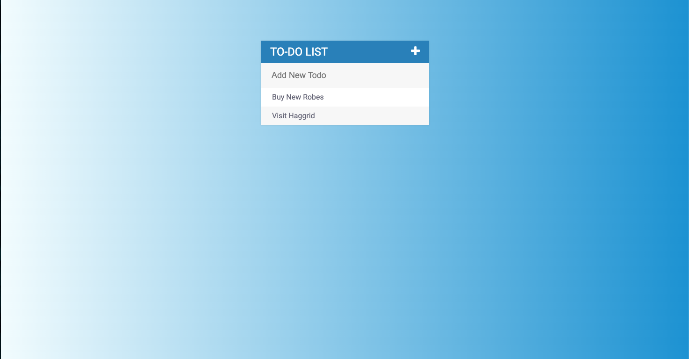

# Todo-List

# Description
>Welcome to the fun TO-DO LIST, here you can delete, add in and cross out your lists of projects for the day. 

[Live Link](https://justinwhite814.github.io/todolist/)

## Installation Instructions
* Fork this repository
* Clone it down to your local machine
* Open in a code editor
* Use your code editor to go live or run a live server

## Screen shots
#### Main Todo

#### New Todo:

## Minimum Viable Product
* Creating new todos
* Deleting any completed todos
* Crossing out any possible done todos

## User Stories
- As A user I want to create todos
- As A user I want to Delete my todos
- As A user I want an organized place to create notes

## Technologies Used:
* jQuery
* HTML
* CSS
* VanillaJS
